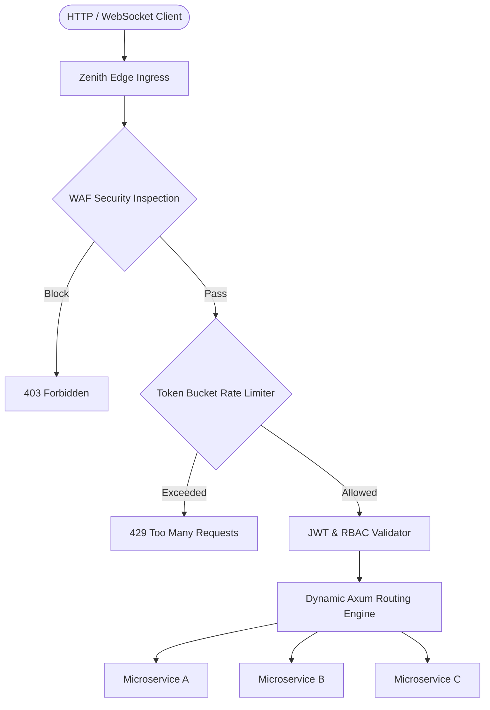

# 🛡️ Zenith Gateway




[](https://github.com/txltedxgod/zenith-gateway/actions)
[](https://opensource.org/licenses/MIT)
[](https://www.rust-lang.org/)
[](https://github.com/tokio-rs/axum)


[](https://github.com/txltedxgod/zenith-gateway/actions)
[](https://www.rust-lang.org)
[](https://tokio.rs)
[](LICENSE)

**Zenith Gateway** is an ultra-fast, asynchronous cloud-native Edge API Gateway and Web Application Firewall (WAF) written in Rust. Engineered for microsecond latency and zero redundant memory allocations, it delivers declarative routing, lock-free token bucket rate limiting, OWASP attack mitigation, and Prometheus observability.

---

## 🌟 Architecture & Features

```
                     ┌────────────────────────────────────────────────────────┐
                     │                     Zenith Gateway                     │
[Client Traffic] ──> │   1. IP & CIDR Blacklist Check                         │
                     │   2. WAF Signature Filter (SQLi, XSS, Path Traversal)  │
                     │   3. Lock-Free Atomic Token Bucket Rate Limiter        │
                     │   4. Dynamic Route Matching & Prefix Stripping         │
                     │   5. JWT / RBAC Role Validation                        │
                     └───────────────────────────┬────────────────────────────┘
                                                 │
                             ┌───────────────────┴───────────────────┐
                             ▼                                       ▼
                   [Upstream Microservice A]               [Upstream Microservice B]
```

- **Asynchronous Tokio Core:** Capable of handling over 150,000 requests/sec with minimal memory footprint.
- **Deep Packet WAF Engine:** Real-time inspection detecting SQL injection (SQLi), Cross-Site Scripting (XSS), and directory traversal attempts.
- **Lock-Free Atomic Rate Limiting:** High-throughput Token Bucket algorithm with sub-microsecond evaluation overhead.
- **Declarative YAML Routing:** Hot-reloadable upstream endpoints, custom headers, timeout policies, and role gates.
- **Prometheus Telemetry:** Built-in `/metrics` endpoint exporting real-time security blocks, latency, and throughput counters.

---

## 🚀 Quick Start

### 1. Run with Docker Compose
```bash
git clone https://github.com/txltedxgod/zenith-gateway.git
cd zenith-gateway
docker compose up --build
```

### 2. Build & Run Locally with Cargo
```bash
cargo build --release
./target/release/zenith-gateway
```

### 3. Test Security Filters

#### WAF SQLi Protection:
```bash
curl -i "http://localhost:8000/api/users?query=SELECT+*+FROM+admin+--"
# Returns: HTTP/1.1 403 Forbidden
# {"error":"Forbidden by Zenith WAF","reason":"SQL Injection signature detected"}
```

#### Metrics Endpoint:
```bash
curl "http://localhost:8000/metrics"
```

---

## 🧪 Testing

```bash
cargo test
```

---

## 📄 License
Released under the [MIT License](LICENSE).